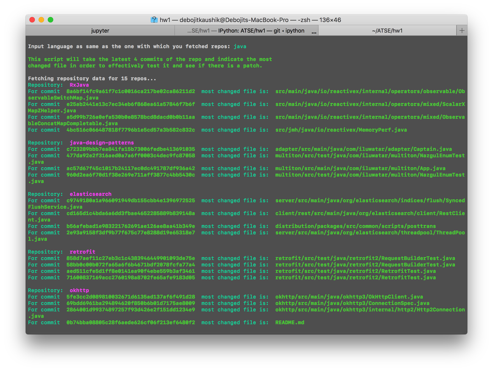

# Repository metadata analytics

## Running the routine

Run the following command to initiate the script. This script is independent of directory due to the fact that
its talking to the GITHUB API directly. 

```
python3 git_analytics.py <your_github_username> <your_github_password>
```

This will then ask for a a language for which you want to see the analytics for.
You may input any language of your choice, but for this excercise input the exact same language as you did to fetch the repositories in ```'fetch_repos.py'```.

After you input the argument, the script will start talking to the API and loop over 15 (predifened range for repos in the script) repositories and analyse for each of the last 4 commits, which files were changed the most. 
This is indicative of more bugs arising in these file as larger changes tend to be more prone to failed testing.

It will output something like: 



It will also create a file named "analytics.md", which is the output file generated in markdown and will contain the output for all 15 repositories.

Note: *You may delete the analytics.md file as its a previously generated file and run your script fresh to generated a new file.*